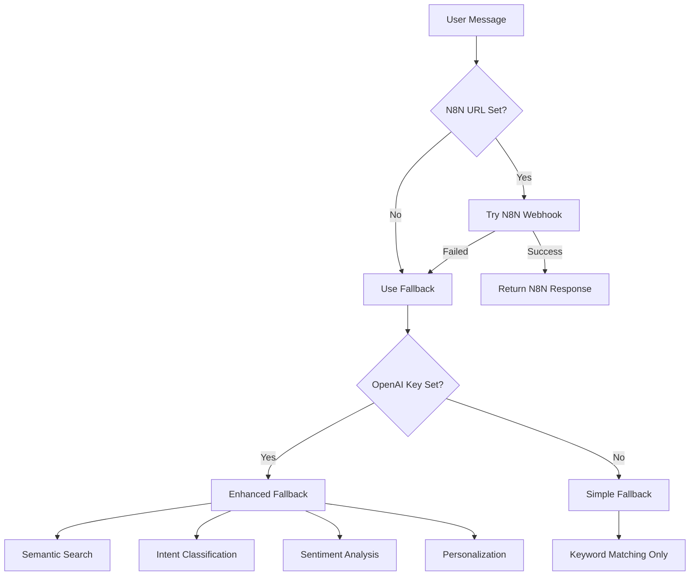

# 🔧 Fix: Chatbot Not Using OpenAI

## 🎯 Problem Identified

Your chatbot is using **simple keyword-based responses** instead of OpenAI because:
- ❌ `OPENAI_API_KEY` is **NOT SET** in your environment
- ❌ `N8N_WEBHOOK_URL` is **NOT SET**

## 📊 Current Behavior

```
User: "I'm looking for a blue dress"
Bot: "I can help you find products within your budget. What price range are you looking for?"
     ☝️ Generic keyword response (NOT intelligent)
```

## ✅ Expected Behavior (After Fix)

```
User: "I'm looking for a blue dress"
Bot: "I found some beautiful blue dresses that match your style! Here are my top recommendations..."
     ☝️ Intelligent, personalized response using OpenAI
```

---

## 🚀 Quick Fix (Choose One)

### Option 1: Use OpenAI Only (Recommended for Most Users)

This is the **easiest and most reliable** option. No N8N setup needed!

```bash
# 1. Create .env file in your project root
cp .env.example .env

# 2. Edit .env and add your OpenAI API key
nano .env  # or use any text editor

# Add this line:
OPENAI_API_KEY=sk-proj-your-actual-key-here

# 3. Restart your dev server
npm run dev

# 4. Test it!
# Your chatbot will now use:
# ✅ Semantic search (finds products by meaning, not just keywords)
# ✅ Intent classification (understands what users want)
# ✅ Sentiment analysis (knows if users are happy/frustrated)
# ✅ Personalization (learns user preferences)
```

**Get Your OpenAI Key:**
1. Go to https://platform.openai.com/api-keys
2. Click "Create new secret key"
3. Copy the key (starts with `sk-proj-`)
4. Paste it in your `.env` file

**Cost**: ~$0.001 per chat message (very affordable)

---

### Option 2: Use N8N + OpenAI Fallback (Advanced)

Use N8N for primary processing with OpenAI as backup.

```bash
# 1. Set up N8N webhook (see N8N_SETUP.md)
# 2. Add to .env:

OPENAI_API_KEY=sk-proj-your-key
N8N_WEBHOOK_URL=https://your-n8n.com/webhook/abc123
```

**Benefits**:
- Custom workflows in N8N
- OpenAI fallback if N8N fails
- Best of both worlds

---

## 🌐 Deploy to Vercel

After setting up locally, deploy to production:

```bash
# Add environment variables to Vercel
vercel env add OPENAI_API_KEY production
# Paste your OpenAI key when prompted

# Optional: Add N8N webhook
vercel env add N8N_WEBHOOK_URL production
# Paste your N8N webhook URL

# Redeploy
vercel --prod
```

Or use Vercel Dashboard:
1. Go to your project → Settings → Environment Variables
2. Add `OPENAI_API_KEY` with your key
3. Redeploy

---

## 🧪 Verify It's Working

### Test 1: Run Diagnostic

```bash
npx tsx scripts/check-openai-config.ts
```

**Expected output:**
```
✅ OPENAI_API_KEY: Set (sk-proj-...xxxx)
✅ Embedding Service: Available (OpenAI key valid)
✅ Personalization Service: OpenAI initialized
✅ OpenAI connection is WORKING!
```

### Test 2: Check Chat Logs

Start your dev server and send a test message. Check logs:

```bash
npm run dev

# In the logs, you should see:
[PersonalizationService] Intent classified by AI: PRODUCT_SEARCH
[PersonalizationService] Sentiment analyzed: positive
[N8NService] Using semantic search with embeddings
[EmbeddingService] Found semantic matches: 5 products
```

**If you see this instead:**
```
[N8NService] Using fallback processing
[N8NService] Simple keyword matching
```
👆 OpenAI is **NOT working** - check your API key!

---

## ❓ Troubleshooting

### Issue 1: "Invalid API Key"

**Cause**: Wrong or expired OpenAI key

**Fix**:
```bash
# Get a new key from OpenAI dashboard
# Update .env
OPENAI_API_KEY=sk-proj-new-key-here

# Restart server
npm run dev
```

### Issue 2: "Insufficient Quota"

**Cause**: No credits in OpenAI account

**Fix**:
1. Go to https://platform.openai.com/usage
2. Click "Add payment method"
3. Add $5-10 credits (will last months!)

### Issue 3: Works Locally But Not on Vercel

**Cause**: Environment variable not set in Vercel

**Fix**:
```bash
# Check Vercel env vars
vercel env ls

# If OPENAI_API_KEY is missing, add it
vercel env add OPENAI_API_KEY production

# Redeploy
vercel --prod
```

### Issue 4: OpenAI Set But Still Using Simple Responses

**Cause**: Multiple possible issues

**Debug**:
```bash
# Check if key is actually loaded
npx tsx scripts/check-openai-config.ts

# Check server logs when sending a message
# Look for "Using semantic search" vs "Simple keyword matching"

# Restart server
npm run dev
```

---

## 📈 How the Chatbot Works

### Architecture Flow



### Enhanced Fallback (with OpenAI)

1. **Intent Classification**: Understands user intent
   - PRODUCT_SEARCH, COMPARISON, PRICING, SHIPPING, etc.

2. **Sentiment Analysis**: Detects user mood
   - Positive, Neutral, Negative

3. **Semantic Search**: Finds products by meaning
   - "blue dress" → finds all blue dresses
   - "comfortable running shoes" → finds athletic shoes with comfort features
   - Works even if exact words aren't in product description!

4. **Personalization**: Learns user preferences
   - Tracks favorite colors, price range, styles
   - Boosts relevant products in future recommendations

### Simple Fallback (without OpenAI)

- Just keyword matching: "dress" → any product with "dress" in name
- No understanding of context or meaning
- No personalization or learning

---

## ✅ Recommended Setup

For best results:

```env
# Minimal (Works Great!)
OPENAI_API_KEY=sk-proj-your-key

# Optimal (Advanced)
OPENAI_API_KEY=sk-proj-your-key
N8N_WEBHOOK_URL=https://your-n8n.com/webhook/abc123
```

**Cost Estimate (OpenAI only)**:
- 1,000 messages = ~$1.00
- 10,000 messages = ~$10.00
- Very affordable for most businesses!

---

## 🎉 That's It!

After following these steps, your chatbot will:
- ✅ Understand user intent
- ✅ Find products by meaning (semantic search)
- ✅ Analyze sentiment
- ✅ Learn user preferences
- ✅ Provide intelligent, personalized responses

**Questions?** Check the logs or run the diagnostic script!
